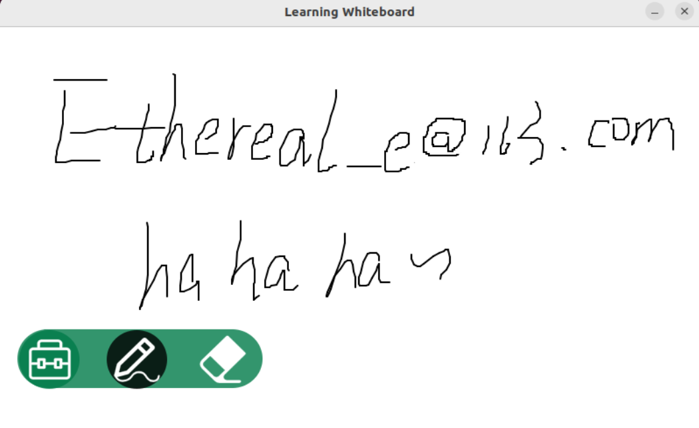

# Learning Whiteboard

Author : Ethereal

Date : 2024.6.15

Introduction : 这是一个基于Linux的学习白板，具有手持终端、投屏终端，在白板上可以随意书写图画，可以绘制图形，用于教学展示，其中还集成了多种功能，包括音频播放、视频播放等功能。

## 更新日志 

2024.6.15：新建了项目文件夹（哈哈），新增README.md文件。

2024.6.16：完成了白板的基础功能，包括绘画、擦除。制作了Learning Whiteboard的Logo~，简易小制作，凑合看吧~展示效果：

2024.6.17：添加了调色版功能，添加了生成形状和函数图像的功能，有待完善框选区域并进行移动功能。大幅减缓项目的更新速度，希望我能找到一个实习。
